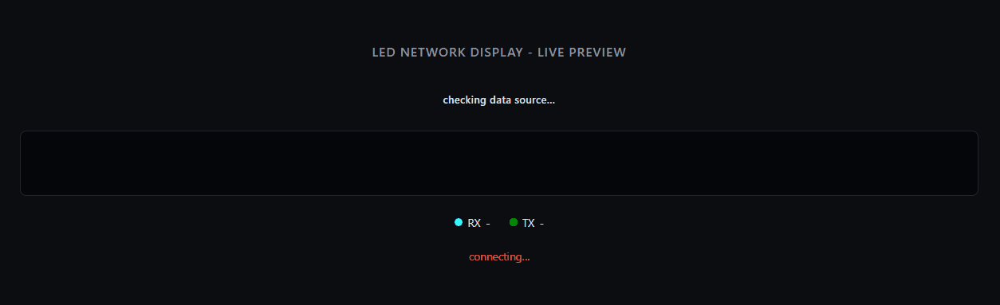
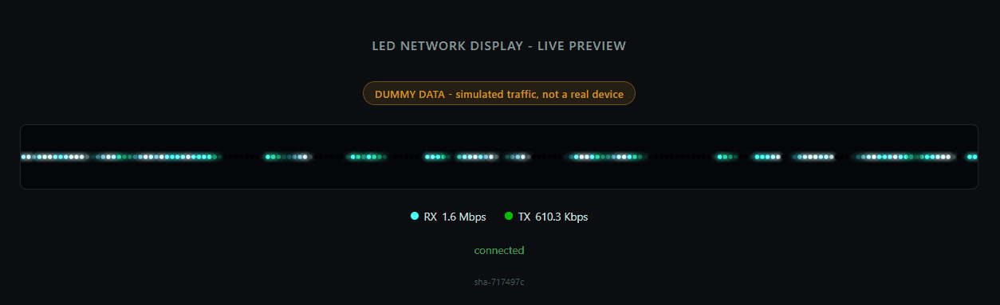

# LED Network Display - poller

Turns network RX/TX byte rates into a moving-particle animation and
renders it to a browser preview and/or a physical WS2812B LED strip via
WLED. Inspired by
[Adam's LED Network Display post](https://adamslab.io/led-network-display.html)
- same concept (two particle streams, RX/TX, real-time SNMP polling),
reimplemented here in Python instead of Node-RED.

> **This project was vibecoded** - I want to be upfront that a lot of
> this was built through conversation with an AI assistant (Claude).
> I understand people have mixed feelings about AI-assisted code, and
> generally agree with those feelings. But for a personal, one-off
> homelab project like this - something you just want to get up and
> running - I think it's a genuinely great tool to have at my
> disposal. And to be honest, I used this project to build a better
> understanding of Agents & Build/Release Workflows.
>
> I have taken great care to review & understand all code changes
> made by AI tools within this project.



*Live mode - polling a real switch over SNMP ([static preview](docs/live.png))*



*Dummy mode - synthetic traffic, no hardware needed ([static preview](docs/dummy.png))*

## Traffic source (`TRAFFIC_SOURCE` in `.env`)

- **`dummy` (default)** - generates synthetic RX/TX traffic (slow
  wandering baseline + occasional random spikes). No SNMP target
  needed, no `pysnmp` import at all. Good for a first run before you've
  got SNMP set up on anything.
- **`snmp`** - polls a real device (see "SNMP mode" below). Requires the
  `SNMP_*` fields in `.env` and `pysnmp-lextudio` installed (already in
  `requirements.txt` / the Docker image).

Switching is just `.env` + restart - the renderer and output sinks
don't know or care which source is feeding them.

## Output sinks

- **Web** - serves a browser page (canvas) showing the strip live over
  WebSocket, plus a banner showing whether it's dummy or live data (and
  which switch/port, if live) and the current RX/TX rates. Good for
  tuning before you have hardware, or for basically running this as a
  little networked mood-light dashboard on its own.
- **WLED** - pushes frames to a real WLED controller via its realtime
  UDP protocol (DRGB). Disabled by default; flip on in `.env` once you
  have a controller on the network.

Both can run simultaneously - useful for confirming the physical strip
matches what the browser shows while tuning colors/speed.

## SNMP mode

Only relevant once you set `TRAFFIC_SOURCE=snmp`. Two things to get right:

**1. Version - `SNMP_VERSION` in `.env`:**
- `v1` / `v2c` - plain community string, no encryption, sent in the
  clear. Fill in `SNMP_COMMUNITY`. SNMPv1's PDU encoding can't carry
  64-bit `Counter64` values, so `v1` specifically falls back to the
  older 32-bit `ifInOctets`/`ifOutOctets` instead of `ifHCInOctets`/
  `ifHCOutOctets` - these wrap at 4GB, which happens often on a busy
  link (~34s sustained at 1Gbps), and a wrap is treated the same as a
  counter reset (a dropped sample, not a corrected delta) - so v1
  traffic can look choppier than v2c/v3 on fast links.
- `v3` - USM auth + privacy, more setup but properly authenticated and
  encrypted. Fill in `SNMP_USER`, `SNMP_AUTH_PASSWORD`,
  `SNMP_PRIV_PASSWORD` (and `SNMP_AUTH_PROTOCOL`/`SNMP_PRIV_PROTOCOL` if
  your device doesn't use the SHA/AES128 defaults).

Which versions/configuration paths are actually available depends
entirely on your switch and its management software - consult its own
documentation for how to enable SNMP and which version(s) it supports.

**2. Which interface - `SNMP_IF_INDEX`:** the numeric SNMP `ifIndex` of
the port you want to monitor, *not* its physical port number - these
often don't match 1:1, especially once VLANs/link-aggregation groups
are in the interface list. Find it by walking `ifDescr`/`ifName`
(`1.3.6.1.2.1.2.2.1.2` / `1.3.6.1.2.1.31.1.1.1.1`) against the device
and matching the description to your physical port.

This isn't limited to physical switch ports - any interface the device
exposes over SNMP works. On an access point, for example, you could
point `SNMP_IF_INDEX` at a per-SSID interface (something like
`wifi0ap0` in `ifName`) instead of the wired uplink, to visualize just
that SSID's aggregate traffic rather than the AP's overall link. No
code changes needed - purely a config choice, found the same way (walk
`ifDescr`/`ifName`). Note this is still per-SSID, not per-client -
IF-MIB has no concept of a single connected device's individual
traffic.

The client (`app/snmp_poller.py`) addresses counters
(`ifHCInOctets`/`ifHCOutOctets`) by raw numeric OID rather than symbolic
MIB name - `pysnmp-lextudio` doesn't bundle the IF-MIB module, so
symbolic lookups throw `MibNotFoundError`. This is standard SNMP
(IF-MIB), not vendor-specific.

### Known working devices

Confirmed end-to-end (real traffic data, not just a connectivity check):

| Vendor   | Hardware               | Firmware      | v1 | v2c | v3 | Notes |
|----------|------------------------|---------------|----|----|----|-------|
| Ubiquiti | US-8-60W               | 7.4.1         | ✅ | ✅  | ✅ | |
| Ubiquiti | USW-Lite-16-PoE*       | 7.5.10*       | ✅ | ✅  | ✅ | No web tooltip (sysDescr is kernel-only) |
| Ubiquiti | USW-24-G2*             | 7.5.10*       | ✅ | ✅  | ✅ | No web tooltip; no ENTITY-MIB either - model/firmware confirmed via app, not SNMP |
| Ubiquiti | UDM-Pro (gateway)      | 5.1.31        | ✅ | ✅  | ✅ | ifIndex 1 is loopback, not WAN - walk ifDescr |
| Ubiquiti | UAP-AC-Lite            | 6.8.2.15592   | ✅ | ✅  | ✅ | Single wired uplink (`eth0`), not multi-port |
| Ubiquiti | UAP-AC-LR              | 6.8.2.15592   | ✅ | ✅  | ✅ | Single wired uplink (`eth0`), not multi-port |

\* Model/firmware confirmed from the UniFi app, not SNMP - this device's
`sysDescr` is kernel-build-only and it doesn't implement ENTITY-MIB
(`entPhysicalTable`) either, so there's no standard SNMP mechanism this
poller queries that exposes its model/firmware at all.

"No web tooltip" means `formatSysDescr()` in `web/index.html` stripped
the kernel/build text out of `sysDescr` and nothing useful was left -
depends entirely on how that device's own SNMP agent formats
`sysDescr`, not a bug here. The UI shows a placeholder ("no additional
device info") rather than a blank tooltip in that case, so it reads as
intentional rather than broken.

Everything in this table follows standard SNMP/IF-MIB and
should work the same way on other vendors' hardware, but that hasn't
been verified - a PR extending this table to other vendors is welcome.
If you're using an AI agent to test a new device, point it to
[`agent-testing.md`](agent-testing.md).

### Testing a new device

The process used to validate everything in the table above, for next time:

1. **Confirm reachability/auth first**, cheaply - a plain `sysName`/`sysDescr` GET (`1.3.6.1.2.1.1.5.0` / `1.3.6.1.2.1.1.1.0`) before worrying about traffic counters at all. SNMP doesn't distinguish "wrong credentials" from "wrong IP" - both just time out - so get this working before debugging anything else.
2. **Find the real `ifIndex` - don't assume 1.** Walk `ifDescr`/`ifName` (`1.3.6.1.2.1.2.2.1.2` / `1.3.6.1.2.1.31.1.1.1.1`) and match the description to the physical port/interface you actually want. Watch for `lo` (loopback) sitting at index 1 on anything Linux-based (gateways, APs) - a dead giveaway if you skip this: RX and TX come back as the *exact same number*, which is essentially impossible for real traffic but exactly what loopback always does.
3. **Verify it's real traffic, not a fluke.** A single counter read tells you nothing - pull it twice a couple of seconds apart and confirm the value actually increased. A single `0` delta isn't necessarily broken (genuine idle moment), but if you can, sample several times to rule that out before concluding either way.
4. **Run it through the actual app, not just raw queries.** Point `.env` at the device, start the app for real, and check `/api/info` plus the web preview - confirms the full pipeline (config validation, `SnmpPoller`, the renderer, the web layer) works together, not just that the raw SNMP mechanics are sound in isolation.
5. **Add a row to the table above** with what you found - vendor, hardware, firmware, which versions actually worked, and anything device-specific worth flagging (tooltip behavior, `ifIndex` quirks, etc.).

## Setup

```
cp .env.example .env
```

Default `.env` values run in dummy mode with the web preview enabled -
no editing required to get something on screen. Worth adjusting anyway:
- `LED_COUNT` - set to your actual strip length once known; safe to leave at default for now, since the web preview scales to whatever count you give it
- `DUMMY_SPIKE_CHANCE` / `DUMMY_SPIKE_MAX_BYTES` - turn up if you want to see heavy-traffic visuals more often while testing

When you're ready to point at a real device, set `TRAFFIC_SOURCE=snmp`
and fill in `SNMP_HOST` / `SNMP_IF_INDEX` plus whichever version's
credential block you're using (see "SNMP mode" above).

## Run

**Locally, without Docker** (fastest way to iterate):
```
python -m venv .venv
.venv/bin/pip install aiohttp   # add pysnmp-lextudio too if using TRAFFIC_SOURCE=snmp
set -a; source .env; set +a     # .env isn't auto-loaded outside Docker
python -m app.main
```

**Via Docker Compose**, pulling the image published by CI:
```
docker compose up -d
```
Pulls `ghcr.io/nsf12345/led-network-poller` and
starts the container. The package is private, so the host running this
needs `docker login ghcr.io` first (a PAT with `read:packages` scope).

Check it started and see the first poll cycle:
```
docker compose logs -f led-network-poller
```
By default (`LOG_LEVEL=INFO`) this only shows startup/connection
messages - the per-poll `RX ... B/s  TX ... B/s` line is `DEBUG`-only,
since it'd otherwise print forever in a long-running container and
the web preview already shows live rates anyway. Set `LOG_LEVEL=DEBUG`
in `.env` to see it (or any other troubleshooting detail). An `SNMP
poll failed` traceback here means check credentials/ifIndex/
reachability, not a code bug - SNMP doesn't distinguish "wrong
password" from "wrong IP" in its errors, it just times out either way.

Then open `http://<host>:<port>` in a browser (port is whatever you've
mapped in `docker-compose.yml`) - you should see the source banner,
live RX/TX numbers, and particles moving across a row of dots whenever
there's real traffic on the monitored interface.

## Tuning

All in `.env`, no code changes needed:
- `RATE_SCALE_MIN_BYTES` / `RATE_SCALE_MAX_BYTES` - sets what counts as
  "idle" vs "maxed out" for the log-scaled brightness/spawn-rate mapping.
  Adjust to your actual link's typical traffic range.
- `RX_PARTICLE_SPEED_PIXELS_PER_SEC` / `TX_PARTICLE_SPEED_PIXELS_PER_SEC` / `PARTICLE_SPEED_JITTER` - animation speed and per-particle variation
- `PARTICLE_TRAIL_LENGTH` / `PARTICLE_MAX_PER_DIRECTION` - trail length and how many particles can be on the strip at once per direction
- `RX_COLOR` / `RX_HIGHLIGHT_COLOR` / `TX_COLOR` / `TX_HIGHLIGHT_COLOR` - comma-separated R,G,B; highlight colors are the bright particle head, fading to the base color along the trail
- `STALE_DATA_TIMEOUT_SECONDS` - if no traffic sample arrives within this window (SNMP target unreachable, etc.), rates decay to zero so the animation fades to idle instead of freezing on old data

## CI / image publishing

See [`.github/workflows/README.md`](.github/workflows/README.md) for
how the image gets built/published and how to cut a release.

## Moving to real hardware

Once you have a WLED controller on the network:
1. Set `WLED_ENABLED=true`, `WLED_HOST=<controller ip>` in `.env`
2. `docker compose up -d` to pick up the env change,
   recreates the container
3. Confirm frames arriving: WLED's UI should show "Live" / realtime mode
   active while the container runs, and revert to its normal preset
   within `WLED_TIMEOUT_SECONDS` if you stop the container - verify that
   fallback explicitly rather than assuming it works
